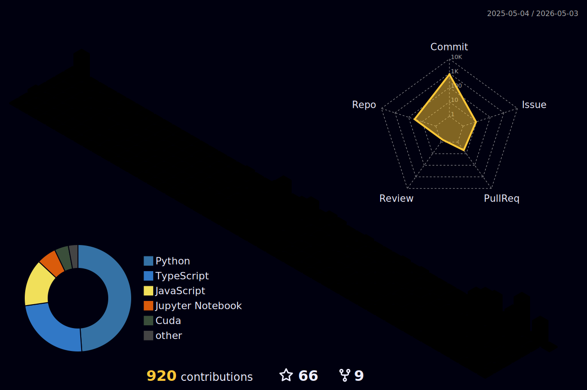

  

<h1 align="center">
  Hi , I'm Jackson Zhao
</h1>

  <strong>Data Scientist @ Mount Sinai</strong> · <strong>Quantitative Methods @ Columbia University</strong> · <strong>MLE @ NYULangone</strong>

  Researcher and Builder in Mental Health AI, Clinical Data Science, and Human-Centered ML.

  

  
  
  
  
  

  
  
  
  

## What I Build 🛠️

- **AI systems for mental health:** chatbot evaluation, safety benchmarking, crisis-response assessment, and human-centered AI tools
- **Clinical and neuroscience AI:** EEG pipelines, synthetic data benchmarking, behavioral signal processing, and mental-state modeling
- **Applied data products:** Streamlit dashboards, research automation, public-health analytics, and decision-support tools
- **LLM and agent workflows:** RAG, LangChain/Ollama systems, prompt orchestration, evaluation pipelines, and production-facing AI applications
- **Multimodal and interaction systems:** computer vision, gesture-based applications, OCR workflows, and interactive AI experiences

## Current Focus 🎯

- Building AI systems for mental health, neuroscience, and high-stakes social impact settings
- Developing benchmark pipelines to evaluate LLM responses for safety, inclusivity, crisis alignment, and readability
- Working on EEG and clinical-data pipelines for addiction, mental state analysis, and synthetic data evaluation
- Translating research workflows into deployable tools using Python, Streamlit, FastAPI, LangChain, and cloud platforms
- Exploring AI agents, RAG, multimodal applications, and human-centered product design across healthcare and public-sector use cases

## Ask Me About 💬

  
  
  
  
  
  

## Featured Projects 🚀

### AI For Mental Health And Evaluation

- [`PsyChat`](https://github.com/ZhaoJackson/PsyChat): Clinical-trial-oriented mental health chatbot evaluation app for multi-turn AI response benchmarking
- [`Text-Reference-AIChatbot`](https://github.com/ZhaoJackson/Text-Reference-AIChatbot): AI chatbot evaluation benchmark for mental health and suicide prevention using ethical alignment, inclusivity, sentiment, and text-similarity metrics
- [`Human_VS_AI_Game`](https://github.com/ZhaoJackson/Human_VS_AI_Game): Interactive Turing Test-style game for comparing human and AI-generated mental health responses

### Clinical, Behavioral, And Multimodal AI

- [`MBTI_Mental_Health`](https://github.com/ZhaoJackson/MBTI_Mental_Health): Mental health analysis project using machine learning and Bayesian tuning
- [`Air_Gesture_Plane_Game`](https://github.com/ZhaoJackson/Air_Gesture_Plane_Game): Computer vision gesture-controlled games using MediaPipe and OpenCV
- [`OCR_Text_Extractor`](https://github.com/ZhaoJackson/OCR_Text_Extractor): OCR-based text extraction web app using React, Ant Design, n8n, and optional Node/Express API

### LLM, Automation, And Applied Products

- [`News_Operator`](https://github.com/ZhaoJackson/News_Operator): Chainlit + Llama3 workflow for fetching updated web information and generating blog-style summaries
- [`ZhaoJackson`](https://github.com/ZhaoJackson/ZhaoJackson): Personal GitHub profile and technical portfolio
- [`Jackson_3D_Profile`](https://github.com/ZhaoJackson/Jackson_3D_Profile): Personal 3D profile website and portfolio experience

## Technical Stack ⚡

**Languages And Frameworks**

  
  
  
  
  
  
  
  
  

**ML, AI, And NLP**

  
  
  
  
  
  
  
  
  
  

**Clinical, Neuroscience, And Data Science**

  
  
  
  
  
  

**MLOps, Cloud, And Deployment**

  
  
  
  
  
  
  
  
  

**Data, Automation, And Interaction Systems**

  
  
  
  
  
  
  
  
  

## Signal Board ✨

  
  
  

## 3D Activity 🌌

  

## GitHub Signals 📊

  
  

  

## Contribution Snake 🐍

  <picture>
    <source media="(prefers-color-scheme: dark)" srcset="https://github.com/ZhaoJackson/ZhaoJackson/blob/output/github-snake-dark.svg?raw=true" />
    <source media="(prefers-color-scheme: light)" srcset="https://github.com/ZhaoJackson/ZhaoJackson/blob/output/github-snake.svg?raw=true" />
    
  </picture>

  If you're building AI for mental health, neuroscience, clinical data systems, or high-stakes human-centered applications, let's connect.

