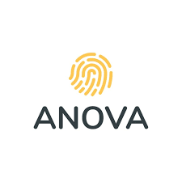
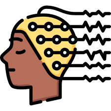

<h1 align="center">Hi  , I'm Jackson Zhao</h1>
<h2 align="center">Researcher in Mental Health, Data Science, and AI</h2>

  

- 🔭 I'm currently working on **AI/ML Projects in Mental Health in healthcare and professional settings**

- 🌱 I'm currently learning **SQL, Python, LLMs, AI Agents, RAG for Mobile Applications**

- 💬 Open for Collaboration **Python, SQL, Data Science, Langchain, NLP, Psychology, Neuroscience**

- 🔥 **Research and Production** are my pursuit and passion in Mental Health realm.

- 📫 How to reach me **zichenzhao2022@gmail.com**
 
<h3 align="left">Connect with me:</h3>

 
 

<h2 align="left">🛠️ Skills and Technologies:</h2>

### 💻 Technical Skills

 
  
  
  
  
  
  
  
  
  
  
  
   
  
  
  
  
  
  
   
  
  
  
  
  
  
  
  
  
  
  

### 📊 Psychometrics & Statistics

  
  
  
  
  
  

### 🧠 Psychology Domain Knowledge

  
  
  
  
  
  
  

## 📊 My GitHub Statistics

  

### 💻 Languages and Achievements

   
    
    
   

  
### 🏆 Accomplishments

   
   
   

## 🐍 Activity Graph

  
  ### 📈 Contribution Graph
  

    
  

  

